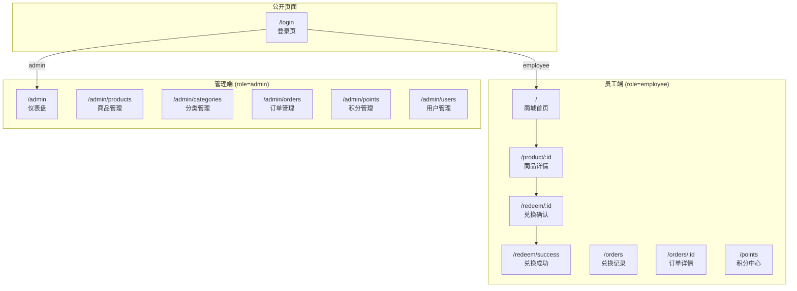
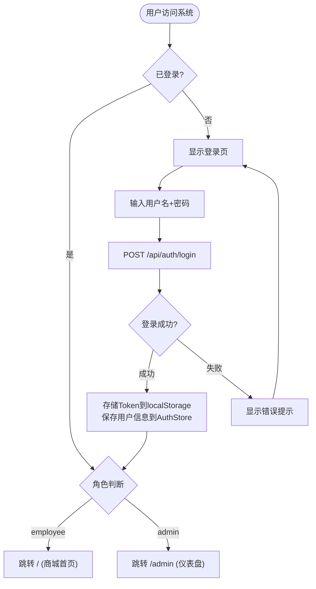
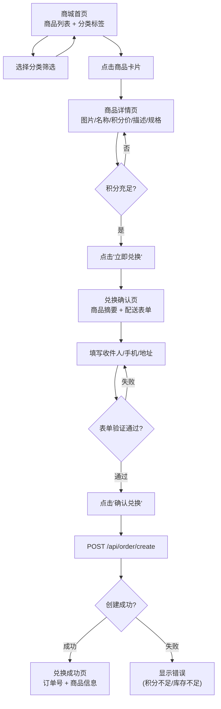
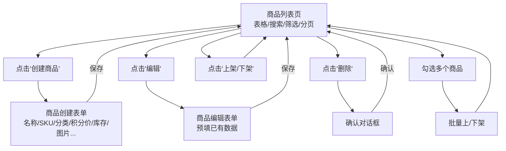

# Web Frontend — 业务逻辑模型

## 页面结构与路由



---

## 核心业务流程

### 1. 登录流程



### 2. 商品浏览与兑换流程 (员工端)



### 3. 管理员商品管理流程



---

## 页面组件设计

### 员工端页面

| 页面 | 主要组件 | 数据来源 |
|------|---------|---------|
| ShopHome | ProductGrid, CategoryChips, Pagination | GET /api/product/list + GET /api/category/list |
| ProductDetail | ProductImage, ProductInfo, SpecSelector, RedeemButton | GET /api/product/{id} |
| RedemptionPage | ProductSummary, DeliveryForm, ConfirmButton | 本地state + POST /api/order/create |
| RedemptionSuccess | SuccessIcon, OrderInfo | 路由参数 |
| OrdersPage | OrderList, StatusFilter, Pagination | GET /api/order/list |
| OrderDetail | OrderInfo, StatusTimeline, DeliveryInfo | GET /api/order/{id} |
| PointsCenter | BalanceCard, StatsCard, TransactionList, TypeFilter | GET /api/points/balance + GET /api/points/transactions |

### 管理端页面

| 页面 | 主要组件 | 数据来源 |
|------|---------|---------|
| Dashboard | StatCards, Charts (后续) | 汇总API (后续) |
| ProductManage | DataTable, SearchBar, CreateDialog, EditDialog, ConfirmDialog | /api/admin/product/* |
| CategoryManage | DataTable, CreateDialog, EditDialog, SortableList | /api/admin/category/* |
| OrderManage | DataTable, StatusFilter, StatusUpdateDialog | /api/admin/order/* |
| PointsManage | UserPointsTable, GrantDialog, DeductDialog | /api/admin/points/* |
| UserManage | DataTable, CreateUserDialog | /api/admin/user/* |

---

## API Service 层设计

### authService.ts
```typescript
login(username: string, password: string): Promise<LoginResponse>
```

### productService.ts
```typescript
getList(params: ListProductParams): Promise<PageResult<Product>>
getById(id: number): Promise<Product>
create(data: CreateProductRequest): Promise<Product>
update(data: UpdateProductRequest): Promise<Product>
delete(id: number): Promise<void>
updateStatus(id: number, status: number): Promise<void>
batchUpdateStatus(ids: number[], status: number): Promise<void>
```

### categoryService.ts
```typescript
getPublicList(): Promise<Category[]>
getList(): Promise<Category[]>
create(data: CreateCategoryRequest): Promise<Category>
update(data: UpdateCategoryRequest): Promise<Category>
delete(id: number): Promise<void>
```

### orderService.ts
```typescript
create(data: CreateOrderRequest): Promise<Order>
getMyOrders(params: ListOrderParams): Promise<PageResult<Order>>
getById(id: number): Promise<Order>
getAllOrders(params: ListOrderParams): Promise<PageResult<Order>>
updateStatus(id: number, status: string): Promise<void>
```

### pointsService.ts
```typescript
getBalance(): Promise<PointsBalance>
getTransactions(params: ListTransactionParams): Promise<PageResult<Transaction>>
grant(data: GrantPointsRequest): Promise<void>
deduct(data: DeductPointsRequest): Promise<void>
getAccounts(params: ListAccountsParams): Promise<PageResult<PointsAccount>>
```

### userService.ts
```typescript
getProfile(): Promise<User>
create(data: CreateUserRequest): Promise<User>
getList(params: ListUserParams): Promise<PageResult<User>>
```

---

## 状态管理设计

### useAuthStore (改造 — 对接真实API)
```typescript
interface AuthState {
  user: UserInfo | null;
  token: string | null;
  isAuthenticated: boolean;
  login(username: string, password: string): Promise<boolean>;
  logout(): void;
}
// 改造点: 移除Mock数据，调用 authService.login()
// Token 存储: localStorage('token')
// 用户信息: Zustand persist
```

### useAppStore (已有 — 无需改动)
```typescript
interface AppState {
  darkMode: boolean;
  language: 'zh' | 'en';
  toggleDarkMode(): void;
  setLanguage(lang: string): void;
}
```

---

## 表单验证规则

### 配送信息表单 (兑换)
| 字段 | 规则 |
|------|------|
| recipientName | 必填, 2-20字符 |
| phone | 必填, 11位手机号格式 |
| address | 必填, 5-200字符 |

### 商品创建/编辑表单 (管理)
| 字段 | 规则 |
|------|------|
| name | 必填, 2-200字符 |
| sku | 必填, 唯一 |
| category | 必填, 下拉选择 |
| pointsPrice | 必填, 正整数 |
| stock | 必填, >=0 |
| status | 必填, 0或1 |
| imageUrl | 选填, URL格式 |

### 积分发放/扣除表单 (管理)
| 字段 | 规则 |
|------|------|
| userId | 必填, 下拉选择用户 |
| points | 必填, 正整数 |
| description | 必填, 说明原因 |

### 创建用户表单 (管理)
| 字段 | 规则 |
|------|------|
| username | 必填, 4-32字符, 字母数字下划线 |
| password | 必填, >=6字符 |
| displayName | 必填, 2-50字符 |
| email | 选填, 邮箱格式 |
| role | 必填, admin/employee |

---

## 错误处理策略

| 场景 | 前端处理 |
|------|---------|
| 网络错误 | Snackbar 提示"网络异常，请稍后重试" |
| 401 未认证 | 清除token，跳转 /login |
| 403 无权限 | Snackbar 提示"无权限操作" |
| 400 参数错误 | 表单字段级错误提示 |
| 业务错误 (积分不足等) | Dialog/Snackbar 显示后端返回的 message |
| 500 服务器错误 | Snackbar 提示"系统繁忙" |

## 加载状态

- 所有 API 调用展示 Loading 状态
- 列表页: 表格 Skeleton 加载
- 详情页: 全页面 Skeleton
- 按钮操作: 按钮 loading + disabled
